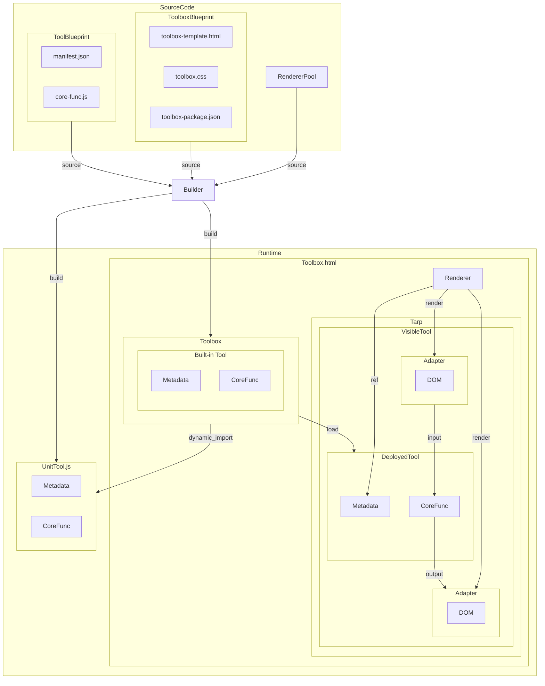

## 概要の概要
- html + インラインjsによるツール
- 外部ライブラリ、cssに依存しない
- CLIのGUI化したような設計思想で、1つのツールはシンプルな入出力と1つの役割を持つ

## 想定利用環境
以下のような、まともな既存システムも無え！　新規開発も無え！　まともな認可済みソフトも無え！
そんな都会の僻地、オフィスの荒野でサバイバルする人々のためのツール

### まともな既存システムも無え！
- 不連続なシステム
  - システム化されているが、システム同士が繋がっておらず、手作業の変換・目視確認が必要
  - システムを管理する部署にメールや別システム経由のデータ追加・更新の依頼が来る……ExcelやWordで
  - スニーカーネット
- 貧弱なチェックシステム
  - システムはあるが、バリデーションが貧弱でどんなデータも受け入れるが、誤ったデータは機能しないか障害を引き起こす
  - プレビューできない
- レガシーシステム
  - 何が駄目なのか、いざ言葉にしようとすると難しいが、設計思想が古すぎるせいで、大体全てが駄目な直すより作り直すほうが速そうなシステム
- 生データの利用
  - CLIやAWSのDynamoDB、SQLなどの、剥き出しのシステムを直接の扱う必要があり、使いづらい生データの処理が必要
  - 個人情報やシステム構成のような機密情報を含み得るため、馬の骨の無料変換サイトが使えない

### 開発も無え！
- 既存システムがパッケージのため改修不可、または余力、政政治的な理由など何らかの理由により改修できない
- 費用、政治的或いは何らかの理由により新規システムを満足に開発する事ができない
- サーバーも建てる事ができない

### まともな認可済みソフトも無え！
- インストールできるのはMSオフィスとサクラエディタ、WinMergeのみ
- Python、Node、その他追加が必要なランタイムは一切無し
- SDK？　なにそれおいしいの？

### 木こりはいるが、金物屋はいねえ！
- 木こりも大工もいるが、木を切り、新しいシステムを建てるのに忙しすぎて、ボロボロの刃を砥ぐ暇も、砥ぐ為に金物屋を雇うお金もない

### おらこんな環境いやだ
- シリコンバレーに出だなら、USBにデータ貯めで、専用端末まで持っていくだ


## 実装と実行までの流れ
- 実装
  - 1. @developer DOM操作をしないピュアなコア関数を実装する
  - 2. @developer コア関数のパラメータやヘルプについてマニフェストを記載する
- ビルド
  - 1. @system テンプレートhtmlにツールのマニフェストやコア関数、メタデータやレンダラーを埋め込む
  - 2. @system （静的生成の場合）メタデータに基づき入出力用のUIを自動生成する。
- 実行
  - 1. @user ツールボックスからツールを選択する
  - 2. @system ツールをタープ（実行領域）上にロードする
  - 3. @system （動的生成の場合）メタデータに基づき入出力用のUIを自動生成する。
  - 4. @user ツールに入力し、実行する
  - 5. @system DOMのデータを読み取り、対象関数を実行し、結果をUI（クリップボード、ダウンロード含む）に出力する


## 構成要素
### 実行時
#### ツールボックス
- CLIにおけるシェルに相当
- ビルダーによって生成される
- 役割
  - ツール（コマンド）の管理
  - ツール一覧の提供
  - 一時変数を表示・設定するUIの提供
  - コンポジションを入力するUIの提供

#### ブルーシート（Tarp）
- ツールをロードする領域

#### ツール
- ツールボックスから選択され、実行される
- CLIにおける1個のコマンドに相当

##### ツールUI
- ビルド時に指定されたRendererによってメタデータを基に生成される
- 役割
  - 入力インターフェースの提供
    - コア関数が必要とするパラメータの入力DOMを表示する
    - 一時変数を管理するDOMを表示する
  - 実行インターフェースの提供
    - コア関数の実行ボタンの提供
    - コア関数の、その他の実行ボタンの提供
  - 出力インターフェースの提供
    - コア関数の結果をDOM、ダウンロード、クリップボードへ出力する

##### コア関数
- ツールの機能として実行される関数
- DOMから切り離されたサンドボックス内で実行される

#### Renderer
ツールのメタデータからDOMを生成する

#### Adapter
Rendererが生成したDOMをコア関数の入出力に使えるよう、DOMのデータ入出力、イベントの制御を行う


### ビルド
#### ビルダー
- ツールのマニフェストと関数、ツールボックスのテンプレートからツールボックスをビルドする
- ビルドに必要な入力
  - ツールボックスのブループリント（toolbox-template.html, toolbox.css, toolbox-package.json）
  - ツールのブループリント（マニフェスト、関数）
  - レンダラー
- モード
  - ビルトイン
    - ツールボックスにツールをインラインスクリプトとして埋め込む
    - 全てのツールをビルトイン化したツールボックスは、1ファイルになる（スイスアーミーナイフ）
  - ユニット
    - ツールをツールボックスから分離したjsファイルにビルドする
    - ツールボックスはラベルと相対パスのみを持ち、当該ツールが選択されると動的にロードされる
    - ツール単体でビルドできるため、リビルトと差し替え、手修正
    - ツールボックスの定義もコンパクトなため追加・削除も容易


#### ツールボックス・ブループリント

#### ツール・ブループリント
##### マニフェスト
- ツールのメタデータ
- ツール製作者が記述する
- 役割
  - コア関数はDOMを制御しないため、代わりにマニフェストにツールの入出力インターフェースを定義する
  - パラメータの初期値の定義（ビルド後にオーバーライド可能）
  - アクションの定義
  - 他関数のインポート
  - ストレージなどAPIのインポート
  - ヘルプ

##### コア関数
- CLIにおける1つのコマンド（実行体）に相当
- ツール製作者が記述する
- ピュアな関数で原則、入力は引数のみ、出力は戻り値（ストレージ）のみ
- 通信やストレージも、APIとして引数で受け取る
- マニフェストに記述すれば、他の関数をインポートして再利用できる

### コンポジション
- ツールの一種で、CLIにおけるパイプで繋がれたコマンド
- ツールを一から実装しなくても、複数のツールを連結して新しいツールを組み立てられる
- 不足している必須パラメータは各ツールのマニフェストから自動的に生成される
- ビルド用のブループリントだけでなく、実行時に専用インターフェースから即興で組み立て、実行・登録てきる

```
[
  { "$": "open", "filter": "csv" }, // ダイアログが表示
  { "$": "parse-csv", "src": "$" }, // "src": "$" は直前の結果をsrcの入力にする（省略時のデフォルト動作）
  "table-to-json",                  // パラメータが全て省略できる場合はstring可
  { "$": "download", "defaults": { "name": "data.json" } }
]
```


## 概略図
